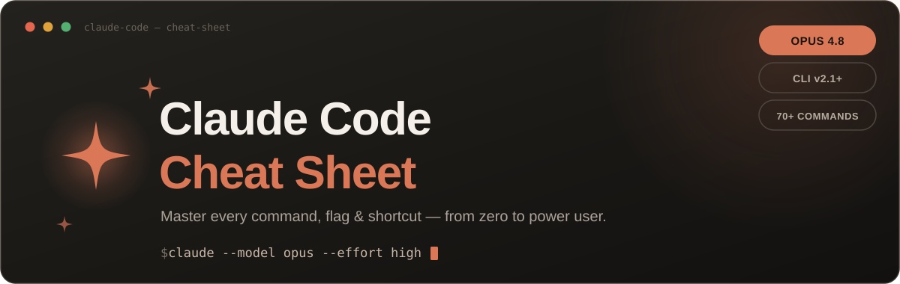
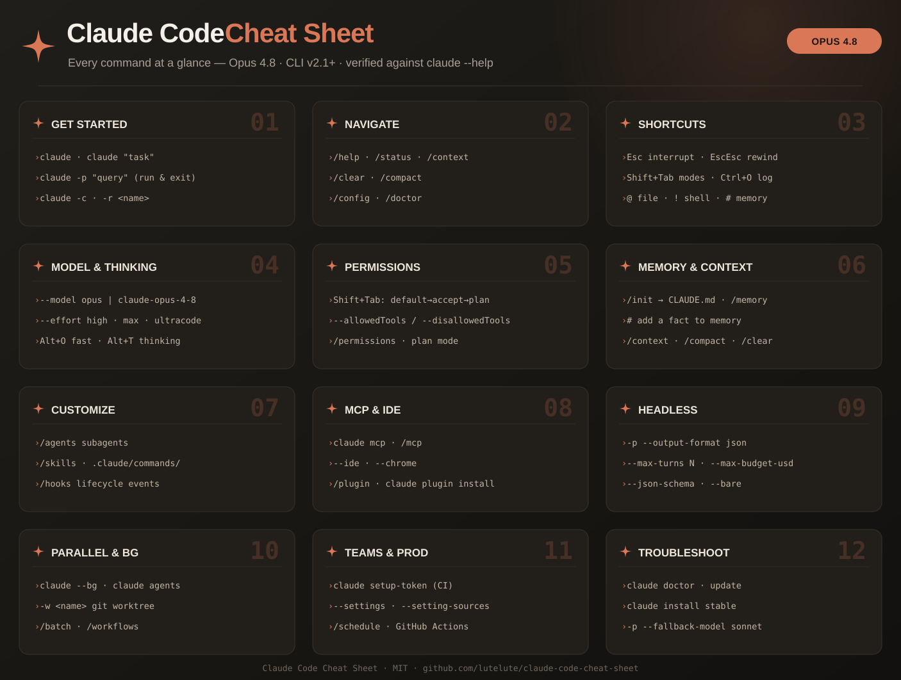
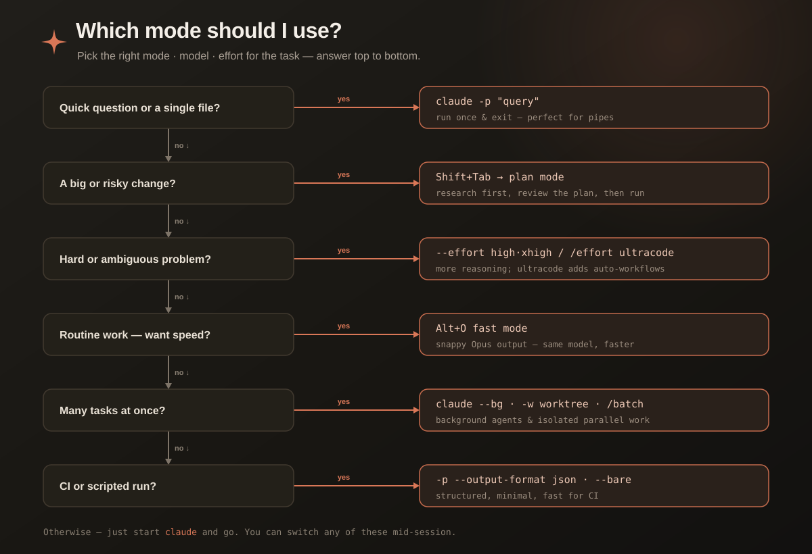

<p align="center">
  
</p>

<h1 align="center">Claude Code Cheat Sheet</h1>

<p align="center">
  <b>Not just every command — the way the pros actually use Claude Code.</b><br>
  Real workflows, god-tier setup, accuracy boosters, and the mistakes to avoid. Tuned for <code>Opus 4.8</code> / CLI <code>v2.1+</code>.
</p>

<p align="center">
  
  
  
  
  
</p>

<p align="center">
  <b>English</b> &nbsp;·&nbsp; <a href="README.ja.md">日本語</a>
</p>

---

> Most cheat sheets just dump flags you could get from `--help`. This one leads with **how Anthropic's own engineers get the most out of Claude Code** — then keeps the full command reference one click away. Everything verified against `claude --help` (v2.1.x) and the official docs.

## 📚 Contents

**🧠 The good stuff (start here):** [🏆 Pro Moves](#-pro-moves) · [⚙️ God-Tier Setup](#️-god-tier-setup) · [🎯 Accuracy Boosters](#-accuracy-boosters) · [😅 Anti-Patterns](#-anti-patterns)
**🗺️ Orientation:** [📄 One-pager](#-one-page-cheat-sheet) · [🧭 Which mode?](#-which-mode-should-i-use) · [⚡ Quick Start](#-quick-start)
**📦 Reference (collapsed):** [📖 Command Guide](#-command-guide) · [📋 Tables](#-reference-tables) · [🔧 Deep Dives](#-deep-dives) · [🤖 Subagents](subagents.md)

## 📄 One-Page Cheat Sheet

<p align="center">
  
</p>

## ⚡ Quick Start

```bash
curl -fsSL https://claude.ai/install.sh | bash   # macOS/Linux/WSL  (Windows: irm https://claude.ai/install.ps1 | iex)
claude auth login                                # sign in
cd your-project && claude                        # start in your repo
```

Then run `/init` to generate a `CLAUDE.md`, and you're off.

---

# 🧠 The Good Stuff

> The single most important fact about Claude Code: **its context window fills up fast, and quality drops as it fills.** Almost every tip below is really about protecting that context. Keep it clean and Claude stays sharp.

## 🏆 Pro Moves

How people who use Claude Code all day actually drive it.

### 1. Explore → Plan → Code → Commit

Don't let Claude jump straight to code on anything non-trivial — it'll confidently solve the *wrong* problem. Separate thinking from doing:

```text
1. Shift+Tab → plan mode.  "read src/auth and explain how sessions work"   (no edits yet)
2. "add Google OAuth — what changes? write a plan."   → Ctrl+G to edit the plan
3. Shift+Tab back.  "implement your plan, write tests, run them, fix failures"
4. "commit with a clear message and open a PR"
```

> Skip the plan for one-sentence diffs (typo, log line, rename). Use it when the change spans files or you're unsure of the approach.

### 2. Give Claude a way to verify its work 🔑

This is the difference between *babysitting* a session and *walking away* from one. Hand Claude a check that returns pass/fail and it closes the loop itself.

| Instead of… | Do this |
|:--|:--|
| "implement email validation" | "write `validateEmail`. tests: `a@b.com`→true, `a@.com`→false. **run the tests after**" |
| "make the dashboard look better" | "[paste screenshot] match this. **take a screenshot, compare, list diffs, fix**" |
| "the build is failing" | "[paste error] fix the **root cause**, don't suppress it, then verify the build passes" |

Make it stick harder with `/goal <condition>` (re-checked every turn) or a **Stop hook** (blocks the turn until your script passes). Always ask for evidence — the test output, not "done ✅".

### 3. Be specific. Point at things.

Vague in, vague out. The more precise the prompt, the fewer rounds of correction.

```text
❌ "fix the login bug"
✅ "users report login fails after session timeout. check src/auth/ token refresh,
    write a failing test that reproduces it, then fix it"

❌ "add a calendar widget"
✅ "follow the pattern in @HotDogWidget.php to add a calendar widget. no new libraries."
```

Feed it rich context: `@file` to include a file, **paste screenshots** (Ctrl+V), give doc URLs, or pipe data (`cat error.log | claude -p "find the cause"`).

### 4. Course-correct early — and `/clear` often

Tight feedback loops beat one perfect prompt. The moment Claude drifts:

- **`Esc`** — stop mid-action (context preserved, just redirect)
- **`Esc` `Esc`** / **`/rewind`** — roll back conversation, code, or both to a checkpoint
- **`/clear`** — wipe context between unrelated tasks

> 🔑 **The two-correction rule:** if you've corrected Claude twice on the same thing, the context is now polluted with failed attempts. `/clear` and restart with a sharper prompt. A clean session almost always beats a long, messy one.

### 5. Delegate research to subagents

Exploring a big codebase floods your context with file reads. Push that into a subagent — it explores in its *own* context and reports back just the summary.

```text
use a subagent to investigate how we handle token refresh, and whether we
already have OAuth utilities I should reuse
```

### 6. Use a fresh Claude to review

A second session reviewing the first's work isn't biased toward code it just wrote. Run the **Writer/Reviewer** pattern, or just use the bundled skill:

```text
/code-review          review the current diff for bugs (fresh subagent)
/security-review      same, for vulnerabilities
```

### 7. Let Claude interview you for big features

```text
I want to build [X]. Interview me with the AskUserQuestion tool — dig into the
hard parts I haven't considered, then write a complete spec to SPEC.md
```

Then start a **fresh session** to implement from `SPEC.md` (clean context, written spec to check against).

---

## ⚙️ God-Tier Setup

Five minutes of setup that pays off in every session.

- **`/init` → grow your `CLAUDE.md`.** Persistent project context Claude reads every session. (See [Accuracy Boosters](#-accuracy-boosters) for how to write a good one.)
- **Kill the permission prompts.** After the 10th "allow?" you're not reviewing, just clicking. Allowlist safe tools, or let a classifier handle it:
  ```bash
  claude --permission-mode auto          # classifier approves safe stuff, asks on risky
  # or allowlist in settings.json / via /permissions:  "Bash(npm run test:*)", "Bash(git:*)"
  ```
- **Hooks for things that must happen every time.** Unlike `CLAUDE.md` (advisory), hooks are deterministic. Ask Claude to write one: *"write a hook that runs eslint after every file edit."*
- **Install `gh`.** It's the most context-efficient way for Claude to open PRs, read issues, and check CI. Same for `aws`, `gcloud`, `sentry-cli`.
- **`/terminal-setup`** (Shift+Enter for newlines) and, on macOS, [enable Option as Meta](https://code.claude.com/docs/en/terminal-config) so `Alt+P/T/O` work.
- **Show context usage** in a custom [`statusLine`](https://code.claude.com/docs/en/statusline) so you can see the window filling up.

<details>
<summary><b>A solid starter <code>settings.json</code></b></summary>

```json
{
  "$schema": "https://json.schemastore.org/claude-code-settings.json",
  "model": "opus",
  "effortLevel": "high",
  "permissions": {
    "allow": ["Bash(npm run test:*)", "Bash(git:*)", "Read(./src/**)"],
    "deny":  ["Read(./.env)", "Read(./.env.*)", "Bash(curl:*)"]
  },
  "hooks": {
    "PostToolUse": [
      { "matcher": "Edit|Write", "hooks": [{ "type": "command", "command": "npm run lint --silent" }] }
    ]
  },
  "env": { "MAX_THINKING_TOKENS": "32000", "BASH_DEFAULT_TIMEOUT_MS": "300000" }
}
```
Precedence (later wins): user `~/.claude/settings.json` → project `.claude/settings.json` → local `.claude/settings.local.json` → CLI flags → managed.
</details>

---

## 🎯 Accuracy Boosters

Concrete ways to make the output *better*, not just faster.

- **Write a `CLAUDE.md` that earns its place.** It loads every session, so for each line ask: *"would removing this make Claude mess up?"* If not, cut it. **A bloated `CLAUDE.md` makes Claude ignore half of it.** Add `IMPORTANT:` / `YOU MUST` for rules it keeps missing.
- **Always give it a check** (tests/build/screenshot). Unverified code that *looks* right is the #1 source of bad output. See [Pro Move #2](#-pro-moves).
- **Spend reasoning where it counts.** `--effort high`/`xhigh`, `/effort ultracode`, or extended thinking (`Alt+T`) on hard problems; keep it low for routine edits.
- **Be specific & point with `@`.** Precise context beats a clever model on a vague prompt.
- **Guard the context window.** `/context` to see what's eating it, `/compact` to summarize, `/clear` between tasks. Performance degrades as it fills — this is the whole game.
- **Go big when you need to.** Pin `claude-opus-4-8[1m]` for the 1M-token window on large codebases.
- **Add an adversarial review.** A fresh subagent that only sees the diff catches what the author-session rationalizes away: *"use a subagent to review this diff against PLAN.md — report gaps that affect correctness, not style."*

---

## 😅 Anti-Patterns

The failure modes everyone hits. Spot them early.

| 😬 The trap | ✅ The fix |
|:--|:--|
| **Kitchen-sink session** — one chat drifts across 5 unrelated tasks; context is full of noise | `/clear` between unrelated tasks |
| **Correcting in circles** — same mistake, third correction, context polluted with failures | After 2 failed corrections, `/clear` + a sharper prompt |
| **The 500-line `CLAUDE.md`** — so long the important rules get lost and ignored | Prune ruthlessly; convert "always do X" rules into hooks |
| **Trust without verify** — plausible code that quietly skips edge cases | Give it tests/screenshots; if you can't verify it, don't ship it |
| **Infinite exploration** — "investigate X" with no scope reads 200 files | Scope it narrowly, or delegate to a subagent |
| **Vibe prompting** — "make it nice" when you know what you want | Name the file, the constraint, the example to follow |
| **Fast mode on a hard problem** — speed when you needed reasoning | `Alt+O` off; reach for `--effort high` + thinking |
| **`--dangerously-skip-permissions` as a habit** | Allowlist + `auto` mode keep you fast *and* safe |

---

## 🧭 Which Mode Should I Use?

<p align="center">
  
</p>

---

# 📦 Reference

The complete command surface — folded away so it doesn't bury the good stuff. Click to expand.

## 📖 Command Guide

<details>
<summary><b>🟢 Daily driver</b> — start, sessions, models, navigation</summary>

```bash
# Start
claude                          # interactive session
claude "summarize this project" # with a prompt
claude -p "explain @src/auth.ts"# print mode: run once, exit
cat error.log | claude -p "find the root cause"

# Sessions & history (nothing is lost)
claude -c                       # continue the latest here
claude -r "auth-refactor" "..." # resume by name/id
claude --resume                 # session picker
claude --from-pr 123            # resume the session behind PR #123
/rewind                         # roll back code/conversation (also Esc Esc)

# Models & thinking
claude --model opus             # latest Opus (4.8); pin claude-opus-4-8[1m] for 1M ctx
/model · /effort high           # switch model / set reasoning effort
Alt+T thinking · Alt+O fast mode
```

**Navigate:** `/help` · `/status` · `/context` · `/clear` · `/compact` · `/config` · `/doctor`
**Must-know keys:** `Esc` interrupt · `Esc Esc` rewind · `Shift+Tab` permission modes · `Ctrl+O` transcript · `@` file · `!` shell · `#` memory
</details>

<details>
<summary><b>🟠 Take control</b> — permissions, memory, customization</summary>

```bash
# Permissions (Shift+Tab cycles modes: default → acceptEdits → plan → auto → …)
claude --permission-mode plan          # read-only: plan first, touch nothing
claude --allowedTools "Bash(git:*)" "Read"
claude --disallowedTools "Bash(rm:*)" "Bash(sudo:*)"
/permissions · /sandbox

# Memory & context
/init · /memory                 # create / edit CLAUDE.md
#                               # prefix a prompt with # to append a fact
/context · /compact · /clear

# Customize
/agents                         # subagents (own context + tools)
/skills · .claude/commands/     # custom commands (file → /name)
/hooks                          # run scripts on lifecycle events
```
</details>

<details>
<summary><b>🔵 Scale up</b> — MCP, headless, parallel, teams</summary>

```bash
# MCP — connect external tools
claude mcp add github -- npx -y @modelcontextprotocol/server-github
claude mcp add --transport sse linear https://mcp.linear.app/sse
/mcp · claude mcp list

# Headless / automation
claude -p "task" --output-format json     # structured output for scripts
claude -p --max-turns 3 --max-budget-usd 5 "task"
claude --bare -p "task"                    # minimal & fast (skip hooks/MCP/CLAUDE.md)

# Parallel & background
claude --bg "investigate the flaky test"  # background agent
claude -w feature-auth                     # isolated git worktree
/batch migrate src/ from class to function components
claude agents · claude attach|logs|stop <id>

# Teams & production
claude setup-token                         # long-lived token for CI
/schedule · /loop 5m "check the deploy"    # cron routines / repeat
```
</details>

## 📋 Reference Tables

<details>
<summary><b>CLI commands & flags</b></summary>

| Command | Description |
|:--|:--|
| `claude` / `claude "q"` / `claude -p "q"` | interactive / with prompt / print-once |
| `claude -c` · `-r <id\|name>` · `--resume` | continue / resume / picker |
| `claude -n <name>` · `--from-pr <PR>` | name a session / resume from a PR |
| `claude -w [name]` · `--bg "task"` | git worktree / background agent |
| `claude agents` · `attach\|logs\|stop\|rm <id>` | manage background sessions |
| `claude auth login\|logout\|status` · `setup-token` | auth / CI token |
| `claude mcp` · `plugin install <p>` · `update` · `doctor` · `install [ver]` | servers / plugins / maintenance |

| Flag | Description |
|:--|:--|
| `--model` · `--effort` · `--fallback-model` | model / `low…max` / headless fallback |
| `--permission-mode` | `default`/`acceptEdits`/`plan`/`auto`/`dontAsk`/`bypassPermissions` |
| `--allowedTools` · `--disallowedTools` · `--tools` | allow / deny / restrict tools |
| `-p` · `--output-format` · `--input-format` | print mode / `text\|json\|stream-json` |
| `--json-schema` · `--max-turns` · `--max-budget-usd` | structured output / caps |
| `--bare` · `--add-dir` · `--settings` · `--mcp-config` | minimal / dirs / settings / MCP |
| `--append-system-prompt` · `--system-prompt[-file]` | extend / replace system prompt |
| `--ide` · `--chrome` · `--fork-session` · `--verbose` | integrations / fork / verbose |
</details>

<details>
<summary><b>Slash commands</b></summary>

| Command | Description |
|:--|:--|
| `/help` `/status` `/doctor` `/config` | help / status / diagnose / settings |
| `/clear` `/compact [focus]` `/context [all]` `/rewind` | context & checkpoints |
| `/resume` `/rename` `/branch` `/export` `/copy [N]` | session management |
| `/model` `/effort [lvl]` `/fast` | model / effort / fast mode |
| `/plan` `/permissions` `/sandbox` | plan mode / permissions / sandbox |
| `/init` `/memory` | CLAUDE.md |
| `/agents` `/skills` `/hooks` `/mcp` `/ide` `/plugin` | extend Claude Code |
| `/code-review [lvl]` `/security-review` `/review` | review the diff |
| `/batch` `/background` `/tasks` `/workflows` | parallel & background |
| `/schedule` `/loop [interval]` | cron routines / repeat |
| `/usage` (`/cost` `/stats`) `/btw` `/goal` `/insights` | usage / side-question / goal / analytics |
</details>

<details>
<summary><b>Keyboard shortcuts & Vim</b></summary>

| Key | Action |
|:--|:--|
| `Esc` · `Esc Esc` | interrupt · rewind menu |
| `Ctrl+C` · `Ctrl+D` | interrupt→clear→exit · exit |
| `Ctrl+O` · `Ctrl+R` · `Ctrl+L` | transcript · history search · redraw |
| `Ctrl+T` · `Ctrl+B` | task list · background a bash command |
| `Ctrl+G` | edit prompt in `$EDITOR` |
| `Shift+Tab` | cycle permission modes |
| `Alt+P` · `Alt+T` · `Alt+O` | switch model · thinking · fast mode |
| `@` · `!` · `#` | file mention · shell mode · memory |
| `Shift+Enter` / `Ctrl+J` / `\`+`Enter` | newline |

**Vim** (enable via `/config` → Editor mode): `i a o` insert · `h j k l` move · `w b 0 $` motions · `dd cw yy p` edit · `u .` undo/repeat · `v V` visual.
</details>

## 🔧 Deep Dives

<details>
<summary><b>🍳 Recipes</b> — copy-paste starting points</summary>

```bash
git diff | claude -p "review this diff for bugs and security issues"
claude -p "/review 123"                          # review a PR
git log --oneline -20 | claude -p "draft release notes grouped by feat/fix"
```
```text
write tests for @src/auth.ts covering the error paths, then run them
trace how a request flows from the router to the database
extract the duplicated validation in these 3 files into one helper
/batch migrate every component in src/ from class to function components
```
</details>

<details>
<summary><b>🧠 Writing a great CLAUDE.md</b></summary>

Loads every session — keep it short, factual, and pruned.

| ✅ Include | 🚫 Exclude |
|:--|:--|
| Build/test commands Claude can't guess | Anything obvious from the code |
| Conventions that differ from defaults | Standard language idioms |
| Architecture in 3–5 lines | Long tutorials / file-by-file notes |
| Gotchas, required env vars | Secrets; things that change often |

`/init` to generate · `/memory` to edit · `#` to append a fact · import with `@path/to/file.md`. Add `IMPORTANT:`/`YOU MUST` for rules it keeps missing. If Claude ignores a rule, the file is probably too long.
</details>

<details>
<summary><b>🪝 Hooks</b> — deterministic automation</summary>

| Event | Fires… |
|:--|:--|
| `PreToolUse` | before a tool runs — **can block it** (exit code `2`) |
| `PostToolUse` | after a tool succeeds (great for auto-lint/format) |
| `UserPromptSubmit` · `Stop` · `SessionStart`/`SessionEnd` | prompt / turn end / session lifecycle |
| `PreCompact` · `SubagentStop` · `Notification` | compaction / subagent / notify |

```json
{ "hooks": { "PostToolUse": [
  { "matcher": "Edit|Write", "hooks": [{ "type": "command", "command": "npm run lint --silent" }] }
] } }
```
Tip: *"write a hook that runs eslint after every file edit"* — Claude will author it.
</details>

<details>
<summary><b>🔌 MCP</b> · <b>🌱 Env vars</b> · <b>🔑 Permission syntax</b></summary>

```bash
# MCP
claude mcp add github -- npx -y @modelcontextprotocol/server-github   # stdio
claude mcp add --transport sse linear https://mcp.linear.app/sse      # remote
claude mcp list · get · remove   # (--scope local|project|user)
```
Servers expose prompts as `/mcp__<server>__<prompt>` and resources you can `@`-mention.

**Permission syntax** — `Tool(pattern)`, deny > ask > allow:
`Bash(npm run test:*)` · `Bash(git:*)` · `Read(./src/**)` · `Read(./.env)` (deny) · `Edit` (bare = all calls).

**Useful env vars:** `ANTHROPIC_API_KEY` · `CLAUDE_CODE_OAUTH_TOKEN` (CI) · `ANTHROPIC_MODEL` · `CLAUDE_CODE_EFFORT_LEVEL` · `MAX_THINKING_TOKENS` · `BASH_DEFAULT_TIMEOUT_MS` · `CLAUDE_CODE_USE_BEDROCK`/`_USE_VERTEX` · `DISABLE_TELEMETRY`.
</details>

<details>
<summary><b>❓ FAQ</b></summary>

- **Which model?** `opus` for hard reasoning/refactors, `sonnet` for everyday speed. Pin `claude-opus-4-8` for reproducibility.
- **`-p` vs interactive?** `-p` for one-shot/scriptable/pipes; the REPL for anything iterative.
- **Asks permission for everything?** Allowlist with `/permissions`, or `Shift+Tab` to `acceptEdits`/`auto`.
- **Context full?** `/compact` to keep going, `/clear` between tasks, `/context` to diagnose.
- **Did it break my files?** No — it checkpoints before edits. `Esc Esc` / `/rewind`. (Not a git replacement.)
- **CI?** `claude setup-token` → `CLAUDE_CODE_OAUTH_TOKEN` → `claude -p --output-format json`.
</details>

---

## 🤖 Subagents

Drop specialized agents into `.claude/agents/` and Claude delegates to them automatically. Ready-made definitions (reviewer, debugger, test engineer, security auditor…) in **[subagents.md](subagents.md)**.

## 🤝 Contributing · License · Resources

PRs welcome — verify new commands against `claude --help` and the [official docs](https://code.claude.com/docs/en/overview) first. Licensed [MIT](LICENSE).

📚 [Best Practices](https://code.claude.com/docs/en/best-practices) · [Common Workflows](https://code.claude.com/docs/en/common-workflows) · [CLI Reference](https://code.claude.com/docs/en/cli-reference) · [Settings](https://code.claude.com/docs/en/settings) · [Hooks](https://code.claude.com/docs/en/hooks) · [Subagents](https://code.claude.com/docs/en/sub-agents)

<p align="center"><sub>⭐ Found it useful? Star the repo and share it. Verified against Claude Code v2.1.x · Opus 4.8.</sub></p>
