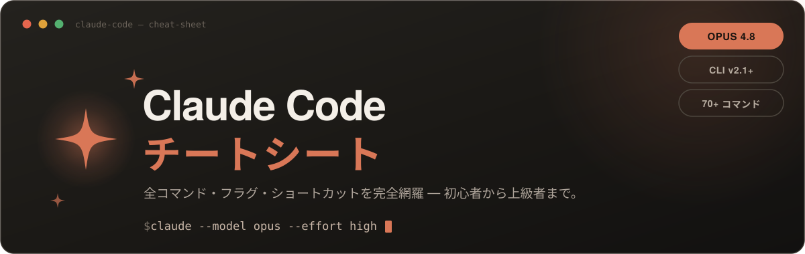
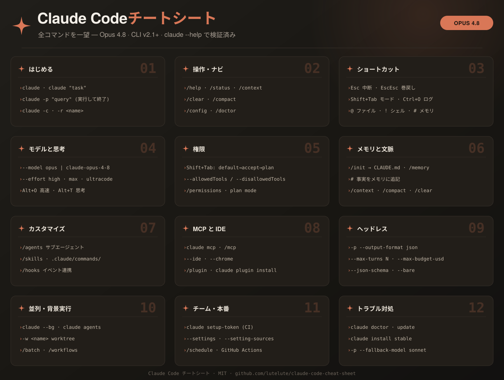
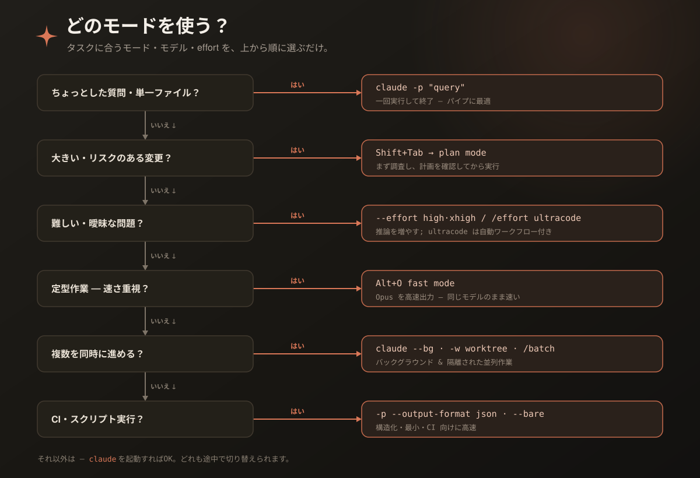

<p align="center">
  
</p>

<h1 align="center">Claude Code チートシート</h1>

<p align="center">
  <b>コマンドの羅列じゃない — 「中の人が本当にやっている使い方」のチートシート。</b><br>
  効くワークフロー・指示の出し方・神設定・落とし穴まで。<code>Opus 4.8</code> / CLI <code>v2.1+</code> 対応。
</p>

<p align="center">
  
  
  
</p>

<p align="center">
  <a href="README.en.md">English</a> &nbsp;·&nbsp; <b>日本語</b>
</p>

---

> たいていのチートシートは `--help` で見られるフラグを並べるだけ。これは **Anthropic のエンジニアが実際にやっている使い方** を中心に据え、全コマンドは折りたたんで下に置く。すべて `claude --help`（v2.1.x）と公式ドキュメントで検証済み。

<p align="center">
  
</p>

## 目次

1. [効く使い方](#効く使い方) — 中の人のワークフロー
2. [指示の出し方](#指示の出し方) — プロンプトの型とコツ
3. [神設定](#神設定) — statusLine・品質ゲート・コスト設計
4. [精度を上げる](#精度を上げる)
5. [あるある](#あるある) — やりがち → 正解
6. [どのモードを使う？](#どのモードを使う)
7. [リファレンス](#リファレンス)（折りたたみ）— [コマンド](#コマンドガイド) / [表](#リファレンス表) / [深掘り](#深掘り) / [Subagents](subagents.md)

## クイックスタート

```bash
curl -fsSL https://claude.ai/install.sh | bash   # macOS/Linux/WSL  (Windows: irm https://claude.ai/install.ps1 | iex)
claude auth login                                # サインイン
cd your-project && claude                        # リポジトリで起動 → /init で CLAUDE.md 生成
```

---

# 効く使い方

> Claude Code で最も大事な事実：**コンテキストウィンドウはすぐ埋まり、埋まるほど精度が落ちる。** 以下のほとんどは、要するにこの文脈を守るための話。きれいに保てば Claude は冴えたまま — だから上級者ほど「何を文脈に入れないか」に注意を払う。

### 調査 → 計画 → 実装 → コミット

ちょっとしたもの以外は、いきなりコードさせない。自信満々で**間違った問題**を解いてくる。思考と作業を分ける。

```text
1. Shift+Tab → plan mode。 「src/auth を読んでセッションの仕組みを説明して」（編集しない）
2. 「Google OAuth を足したい。何が変わる? 計画を立てて」 → Ctrl+G で計画を直接編集
3. Shift+Tab で戻る。 「計画通り実装、テストを書いて実行、失敗を直して」
4. 「わかりやすいメッセージでコミットして PR を作って」
```

一文で説明できる差分（タイポ・ログ行・リネーム）は計画不要。**複数ファイルにまたがる / アプローチに迷う / 触る場所をよく知らない** ときに効く。

### 検証手段を渡す（最重要）

これが「**見張る**セッション」と「**任せて離れられる**セッション」の分かれ目。合否が返る仕組みを渡せば、Claude が自分でループを回す。

| ✗ こうではなく | ✓ こうする |
|:--|:--|
| 「メール検証を実装して」 | 「`validateEmail` を書いて。テスト: `a@b.com`→true, `a@.com`→false。**実装後にテストを実行して**」 |
| 「ダッシュボードをいい感じに」 | 「[スクショ] これに合わせて。**スクショを撮り比較し、差分を直して**」 |
| 「ビルドが失敗する」 | 「[エラー貼付] **根本原因**を直して、握りつぶさず、ビルド成功を確認して」 |

強制力の段階：

- **プロンプト内で**：「実行して通るまで直して」と同じメッセージで指示（今日から効く）
- **セッション全体で**：`/goal <条件>` — 別の評価器が毎ターン再チェックし、満たすまで続ける
- **決定的ゲート**：[Stop hook](#hooks品質ゲート) — スクリプトが通るまでターンを終わらせない（→ 神設定）
- **第三者の目**：fresh subagent / workflow に**反証**を試させる（書いた本人に採点させない）

「完了 ✅」ではなく**証拠**（テスト出力・実行したコマンドと結果）を見せさせること。

### 文脈を守る — subagent と `/clear`

コンテキストが根本制約なので、**subagent は最強の道具**。大きなコードベースの探索はファイル読み込みで文脈を埋め尽くす。subagent は別の文脈で探索し、要約だけ返す。

```text
トークンリフレッシュの扱いと、再利用できる既存の OAuth ユーティリティがあるか、
subagent を使って調査して
```

冗長な出力（テスト実行・ログ解析・ドキュメント取得）も subagent に隔離すると、本文の文脈が汚れない。無関係なタスクに移るときは `/clear`。

### マルチエージェントで検証する

別セッション（fresh context）でレビューさせると、自分が書いたコードへのバイアスがなく質が上がる。

```text
Writer:   API のレートリミッタを実装して
Reviewer: @src/middleware/rateLimiter.ts をレビュー。エッジケース・競合・既存
          ミドルウェアとの整合を見て（← 別セッション、新しい文脈）
```

同じ要領でテストも：片方にテストを書かせ、もう片方に通すコードを書かせる。同梱の `/code-review`・`/security-review` は fresh subagent で diff を見る。さらに自律実行を伸ばすなら [agent teams](#スケールさせる) で検証ループを回し続ける。

### 早く軌道修正

タイトなフィードバックループが、一発完璧プロンプトに勝つ。

- **`Esc`** — 動作の途中で止める（文脈は保持、方向だけ変える）
- **`Esc` `Esc`** / **`/rewind`** — 会話・コード・両方をチェックポイントまで巻き戻す
- **`/clear`** — 無関係なタスクの間で文脈を消す

> **2回ルール:** 同じ点を2回直したら、文脈はもう失敗の試行で汚れている。`/clear` して、学んだことを盛り込んだ鋭いプロンプトで再スタート。きれいなセッションは、長く散らかったセッションにほぼ必ず勝つ。

---

# 指示の出し方

> 出力の質はほぼここで決まる。曖昧に投げれば曖昧に返り、文脈を無駄に食う。

### プロンプトの型

効くプロンプトはだいたいこの4要素でできている：

```
[文脈]  どこを見るか（@file・既存パターン・スクショ）
[タスク] 何をするか（1プロンプト1目的）
[制約]  何を守るか（最初に全部出す）
[検証]  どうなれば完了か（テスト・期待出力）
```

```text
@src/auth/ のトークンリフレッシュを見て（文脈）、セッションタイムアウト後に
ログインが失敗するバグを直して（タスク）。新規ライブラリは使わず（制約）、
まず再現する失敗テストを書いてから直して、テストを実行して（検証）
```

### 具体性が全て

| ✗ 曖昧 | ✓ 具体的 |
|:--|:--|
| 「ログインのバグを直して」 | 「タイムアウト後にログイン失敗。`src/auth/` のトークンリフレッシュを見て、再現テストを書いてから直して」 |
| 「カレンダーwidgetを足して」 | 「`@HotDogWidget.php` のパターンに倣ってカレンダーwidgetを追加。新規ライブラリ禁止」 |
| 「この API なんで変なの?」 | 「`ExecutionFactory` の git 履歴を辿って、この API の経緯を要約して」 |
| 「コードベースを改善して」 | 「`auth.ts` の login 関数に入力バリデーションを足して」（広域スキャンを避け、トークンも節約） |

### さらに効くコツ

- **役割を与える** — 「シニアセキュリティエンジニアとして、注入・認可・秘密情報の観点でレビューして」
- **例を見せる**（few-shot）— 倣ってほしい実装やテストを `@` で指す
- **否定より肯定** — 「Xするな」より「Yして」。望む形を書く
- **リッチな入力** — `@file`、スクショ貼付（Ctrl+V）、ドキュメント URL、`cat error.log | claude -p "..."` でパイプ
- **大きい機能はインタビューさせる** — 「AskUserQuestion で私にインタビューして、難所を掘り下げ、仕様を `SPEC.md` に書いて」→ 新セッションで実装

### 指示のあるある

| ✗ やりがち | ✓ 正解 |
|:--|:--|
| 1つのプロンプトに複数の要求を詰め込む | 1プロンプト1目的。段階的に積む |
| 「なぜ動かない?」と丸投げ | 症状＋再現手順＋期待結果を添える |
| 後出しで制約を足していく | 制約は**最初に全部**出す |
| 「いい感じに」と雰囲気で投げる | 倣う例・期待する形を名指しする |
| Claude の計画を読まずに走らせる | plan mode で計画を確認してから実装 |
| 専門用語だけで文脈ゼロ | ファイル・ドメイン語で対象を指す |

---

# 神設定

5分のセットアップが、毎セッション効いてくる。コピペで使える本物だけ。

### statusLine：コンテキスト残量を常時表示

文脈の埋まり具合が**見えれば**、`/clear` や `/compact` のタイミングを体で覚える。最も費用対効果の高い設定。`~/.claude/statusline.sh` を作る：

```bash
#!/bin/bash
input=$(cat)
MODEL=$(echo "$input" | jq -r '.model.display_name')
PCT=$(echo "$input" | jq -r '.context_window.used_percentage // 0')
COST=$(echo "$input" | jq -r '.cost.total_cost_usd // 0')
EFFORT=$(echo "$input" | jq -r '.effort.level // "-"')
echo "[$MODEL·$EFFORT] ${PCT}% ctx · \$$(printf '%.2f' "$COST")"
```

```jsonc
// ~/.claude/settings.json
{ "statusLine": { "type": "command", "command": "~/.claude/statusline.sh" } }
```

スクリプトを書くのが面倒なら `/statusline モデル名と文脈%をバーで表示して` と頼めば Claude が生成してくれる。stdin の JSON には `context_window.used_percentage` / `cost.total_cost_usd` / `effort.level` / `model` / `rate_limits` などが入る。

### hooks：品質ゲート

`CLAUDE.md`（お願いベース）と違い、hooks は**決定的**。必ず毎回起きてほしいことに。

**編集のたびに自動 lint/format**（`PostToolUse`）：

```json
{ "hooks": { "PostToolUse": [
  { "matcher": "Edit|Write", "hooks": [{ "type": "command", "command": "npm run lint --silent" }] }
] } }
```

**テストが通るまでターンを終わらせない**（`Stop` hook — 自律実行の品質ゲート）：

```json
{ "hooks": { "Stop": [
  { "hooks": [{ "type": "command", "command": "npm test --silent || { echo 'tests failing' >&2; exit 2; }" }] }
] } }
```

終了コード `2` でターンをブロックし、stderr を Claude に返す（8連続ブロックで自動解除）。

**危険な操作をブロック**（`PreToolUse` — `if` で権限ルールフィルタ）：

```json
{ "hooks": { "PreToolUse": [
  { "matcher": "Bash", "hooks": [{ "type": "command", "if": "Bash(rm -rf *)", "command": "echo blocked >&2; exit 2" }] }
] } }
```

**ログを前処理してトークン節約**：10,000行のログを Claude に読ませる代わりに、hook で `ERROR` 行だけ返せば、文脈が数万トークン → 数百トークンに。

> コツ：*「ファイル編集のたびに eslint を走らせる hook を書いて」* と頼めば、Claude が書いてくれる。

### 権限の妙技

承認連打を消しつつ、危険物は確実に止める。`/permissions` か settings で：

```json
{ "permissions": {
  "allow": ["Bash(npm run:*)", "Bash(git:*)", "Bash(gh:*)", "Read(./src/**)", "Edit(./src/**)"],
  "ask":   ["Bash(git push:*)"],
  "deny":  ["Read(./.env)", "Read(./.env.*)", "Read(./secrets/**)", "Bash(rm -rf:*)", "Bash(curl:*)"]
} }
```

`deny` > `ask` > `allow`。あるいは `claude --permission-mode auto` で分類器に任せる（危険なものだけ確認）。

### コスト設計

トークンは文脈サイズに比例する。**prompt cache**（同じ前置きの再利用）は自動で効くので、それを壊さないのがコツ。

| やること | 効果 |
|:--|:--|
| `CLAUDE.md` を**安定**させる（毎回いじらない） | prompt cache が効き続ける |
| `/clear` で無関係タスクを切る | 古い文脈を毎メッセージ運ばない |
| 普段は `sonnet`、難所だけ `opus`／subagent は `haiku` | モデル単価を最適化 |
| 簡単なタスクは effort を下げる・`MAX_THINKING_TOKENS=8000` | 思考トークン（出力課金）を抑える |
| MCP より `gh`/`aws` などの CLI／未使用 MCP は無効化 | ツール定義の文脈を節約 |
| hook でログ前処理／重い知識は skills に逃がす | 文脈を小さく保つ |
| `--bare` で hooks/MCP/CLAUDE.md をスキップ | スクリプト実行を軽量・高速に |

`/usage` で消費、`/context` で内訳を確認。

### 完全版 settings.json

<details>
<summary>上の全部入り — そのままコピペして育てる出発点</summary>

```jsonc
{
  "$schema": "https://json.schemastore.org/claude-code-settings.json",
  "model": "opus",
  "effortLevel": "high",
  "permissions": {
    "allow": ["Bash(npm run:*)", "Bash(git:*)", "Bash(gh:*)", "Read(./src/**)", "Edit(./src/**)"],
    "ask":   ["Bash(git push:*)"],
    "deny":  ["Read(./.env)", "Read(./.env.*)", "Read(./secrets/**)", "Bash(rm -rf:*)", "Bash(curl:*)"]
  },
  "hooks": {
    "PostToolUse": [
      { "matcher": "Edit|Write", "hooks": [{ "type": "command", "command": "npm run lint --silent" }] }
    ]
  },
  "statusLine": { "type": "command", "command": "~/.claude/statusline.sh" },
  "env": { "MAX_THINKING_TOKENS": "32000", "BASH_DEFAULT_TIMEOUT_MS": "300000" }
}
```
優先順位（後勝ち）: user `~/.claude/settings.json` → project `.claude/settings.json` → local `.claude/settings.local.json` → CLI フラグ → managed（組織ロック）。
</details>

### 環境まわり

- **`/terminal-setup`** で Shift+Enter 改行、macOS は [Option を Meta に](https://code.claude.com/docs/en/terminal-config)（`Alt+P/T/O` が効く）
- **`gh` を入れる** — Claude が PR 作成・issue 確認・CI チェックをする最も文脈効率の良い方法
- **`.mcp.json`** をコミットしてチームで MCP サーバーを共有

---

# 精度を上げる

- **居場所に値する `CLAUDE.md`** — 各行に問う：*「これを消したら Claude は間違える?」* 違うなら削る。**肥大すると半分無視される**ので 200 行以内を目安に、重い手順は skills へ。外せないルールには `IMPORTANT:` / `YOU MUST`。
- **必ず検証手段を渡す**（→[効く使い方](#検証手段を渡す最重要)）。それっぽい未検証コードが、悪い出力の最大の原因。
- **推論は要所に** — 難問は `--effort high`/`xhigh`・`/effort ultracode`・拡張思考（`Alt+T`）。定型は低めに。
- **コンテキストを守る** — `/context` で内訳、`/compact` で要約、`/clear` でリセット。埋まるほど精度が落ちる。
- **大規模は 1M** — `claude-opus-4-8[1m]` で 1M トークンウィンドウ。
- **敵対的レビュー** — diff だけを見る fresh subagent は、本人セッションが正当化する穴を見つける：*「この diff を `PLAN.md` と照合してレビュー。スタイルでなく正しさに関わる漏れだけ報告して」*

---

# あるある

### 指示の出し方

| ✗ やりがち | ✓ 正解 |
|:--|:--|
| 複数の要求を1プロンプトに | 1プロンプト1目的、段階的に |
| 「なぜ動かない?」丸投げ | 症状＋再現＋期待結果 |
| 後出しで制約追加 | 制約は最初に全部 |
| 「いい感じに」 | 倣う例を名指し |

### セッション運用

| ✗ やりがち | ✓ 正解 |
|:--|:--|
| 何でも1会話（文脈ノイズだらけ） | 無関係なタスクの間は `/clear` |
| 同じミスを延々修正 | 2回失敗で `/clear` ＋鋭いプロンプト |
| 範囲を絞らず「調べて」で200ファイル | 範囲を絞る／subagent に委譲 |
| 検証せず信用 | テスト/スクショで検証、無理なら出荷しない |

### 設定・運用

| ✗ やりがち | ✓ 正解 |
|:--|:--|
| 500行の `CLAUDE.md` | 容赦なく刈る／手順は hook・skill へ |
| 難問に fast mode | `Alt+O` オフ、`--effort high` ＋思考 |
| `--dangerously-skip-permissions` が癖 | 許可リスト＋`auto` で速くて安全に |

---

# どのモードを使う？

<p align="center">
  
</p>

---

# リファレンス

全コマンド面 — 実践知を埋もれさせないよう折りたたみ。クリックで展開。

## コマンドガイド

<details>
<summary><b>日常使い</b> — 起動・セッション・モデル・操作</summary>

```bash
# 起動
claude · claude "task"          # 対話 / プロンプト付き
claude -p "@src/auth.ts を説明"  # print: 一回実行して終了
cat error.log | claude -p "原因を特定して"

# セッション（何も失わない）
claude -c · -r "name" "..." · --resume   # 継続 / 名前で再開 / ピッカー
claude --from-pr 123            # PR の裏のセッションを再開
/rewind                         # 巻き戻し（Esc Esc も）

# モデルと思考
claude --model opus             # 最新 Opus; 1M は claude-opus-4-8[1m]
/model · /effort high · Alt+T 思考 · Alt+O fast
```
操作: `/help` `/status` `/context` `/clear` `/compact` `/config` `/doctor`
必須キー: `Esc` 中断 · `Esc Esc` 巻戻し · `Shift+Tab` 権限 · `Ctrl+O` ログ · `@` `!` `#`
</details>

<details>
<summary><b>使いこなす</b> — 権限・メモリ・カスタマイズ</summary>

```bash
# 権限（Shift+Tab: default → acceptEdits → plan → auto → …）
claude --permission-mode plan
claude --allowedTools "Bash(git:*)" "Read"
claude --disallowedTools "Bash(rm:*)" "Bash(sudo:*)"
/permissions · /sandbox

# メモリ・文脈
/init · /memory · #（事実を追記）· /context · /compact · /clear

# カスタマイズ
/agents（subagent）· /skills · .claude/commands/ · /hooks
```
</details>

<details>
<summary><b>スケールさせる</b> — MCP・ヘッドレス・並列・チーム</summary>

```bash
# MCP
claude mcp add github -- npx -y @modelcontextprotocol/server-github
claude mcp add --transport sse linear https://mcp.linear.app/sse
/mcp · claude mcp list

# ヘッドレス
claude -p "task" --output-format json
claude -p --max-turns 3 --max-budget-usd 5 "task"
claude --bare -p "task"          # 最小・高速

# 並列・バックグラウンド・チーム
claude --bg "調査"               # バックグラウンドエージェント
claude -w feature-auth           # 隔離 worktree
/batch ... · /workflows          # 大規模を分散
claude setup-token · /schedule   # CI トークン / cron ルーティン
```
agent teams は `CLAUDE_CODE_EXPERIMENTAL_AGENT_TEAMS=1` で有効化（teammate は文脈ごとに増えるので `sonnet`・小さく・終わったら片付け）。
</details>

## リファレンス表

<details>
<summary><b>CLI コマンド & フラグ</b></summary>

| コマンド | 説明 |
|:--|:--|
| `claude` / `"q"` / `-p "q"` | 対話 / プロンプト / 一回実行 |
| `-c` · `-r <id\|name>` · `--resume` | 継続 / 再開 / ピッカー |
| `-n <name>` · `--from-pr <PR>` | 命名 / PR から再開 |
| `-w [name]` · `--bg "task"` | worktree / バックグラウンド |
| `agents` · `attach\|logs\|stop\|rm <id>` | バックグラウンド管理 |
| `auth login\|logout\|status` · `setup-token` | 認証 / CI トークン |
| `mcp` · `plugin install` · `update` · `doctor` | サーバー / 保守 |

| フラグ | 説明 |
|:--|:--|
| `--model` · `--effort` · `--fallback-model` | モデル / `low…max` / 退避 |
| `--permission-mode` | `default`/`acceptEdits`/`plan`/`auto`/`dontAsk`/`bypassPermissions` |
| `--allowedTools` · `--disallowedTools` · `--tools` | 許可 / 拒否 / 制限 |
| `-p` · `--output-format` · `--input-format` | print / `text\|json\|stream-json` |
| `--json-schema` · `--max-turns` · `--max-budget-usd` | 構造化 / 上限 |
| `--bare` · `--add-dir` · `--settings` · `--mcp-config` | 最小 / dir / 設定 / MCP |
| `--append-system-prompt` · `--system-prompt[-file]` | プロンプト追記 / 置換 |
</details>

<details>
<summary><b>スラッシュコマンド</b></summary>

| コマンド | 説明 |
|:--|:--|
| `/help` `/status` `/doctor` `/config` | ヘルプ / 状態 / 診断 / 設定 |
| `/clear` `/compact` `/context` `/rewind` | 文脈 & チェックポイント |
| `/resume` `/rename` `/branch` `/export` `/copy` | セッション |
| `/model` `/effort` `/fast` | モデル / effort / fast |
| `/plan` `/permissions` `/sandbox` | plan / 権限 / sandbox |
| `/init` `/memory` | CLAUDE.md |
| `/agents` `/skills` `/hooks` `/mcp` `/plugin` | 拡張 |
| `/code-review` `/security-review` `/review` | レビュー |
| `/batch` `/background` `/tasks` `/workflows` | 並列・背景 |
| `/schedule` `/loop` · `/usage` `/btw` `/goal` | 自動 / 使用量 / 脇質問 / ゴール |
</details>

<details>
<summary><b>キーボード & Vim</b></summary>

| キー | 動作 |
|:--|:--|
| `Esc` · `Esc Esc` | 中断 · 巻き戻し |
| `Ctrl+O` · `Ctrl+R` · `Ctrl+L` | ログ · 履歴検索 · 再描画 |
| `Ctrl+T` · `Ctrl+B` · `Ctrl+G` | タスク · 背景化 · `$EDITOR` 編集 |
| `Shift+Tab` · `Alt+P/T/O` | 権限循環 · モデル/思考/fast |
| `@` · `!` · `#` | ファイル · シェル · メモリ |

Vim（`/config` → Editor mode）: `i a o` 挿入 · `hjkl` 移動 · `dd cw yy p` 編集 · `u .` 取消/繰返し。
</details>

## 深掘り

<details>
<summary><b>レシピ</b> — コピペで使える</summary>

```bash
git diff | claude -p "この diff のバグとセキュリティをレビュー"
git log --oneline -20 | claude -p "feat/fix 別にリリースノートを作成"
```
```text
@src/auth.ts のエラー経路をカバーするテストを書いて実行して
リクエストがルーターから DB までどう流れるか追って
/batch src/ の全コンポーネントを class から function に移行
```
</details>

<details>
<summary><b>Hooks イベント早見</b></summary>

| イベント | 発火 |
|:--|:--|
| `PreToolUse` | ツール前 — **ブロック可**（exit `2`） |
| `PostToolUse` | ツール成功後（自動 lint/format） |
| `Stop` | ターン終了（テスト品質ゲート） |
| `UserPromptSubmit` · `SessionStart`/`End` | 送信時 / セッション |
| `PreCompact` · `SubagentStop` · `Notification` | 圧縮 / subagent / 通知 |
</details>

<details>
<summary><b>環境変数</b> · <b>権限構文</b></summary>

**環境変数:** `ANTHROPIC_API_KEY` · `CLAUDE_CODE_OAUTH_TOKEN`（CI） · `ANTHROPIC_MODEL` · `CLAUDE_CODE_EFFORT_LEVEL` · `MAX_THINKING_TOKENS` · `BASH_DEFAULT_TIMEOUT_MS` · `CLAUDE_CODE_USE_BEDROCK`/`_USE_VERTEX` · `DISABLE_TELEMETRY`

**権限構文** — `Tool(pattern)`、deny > ask > allow:
`Bash(npm run:*)` · `Bash(git:*)` · `Read(./src/**)` · `Read(./.env)`（拒否） · `Edit`（名前のみ = 全呼び出し）
</details>

<details>
<summary><b>FAQ</b></summary>

- **どのモデル?** 難所は `opus`、日常は `sonnet`、再現性は `claude-opus-4-8` を固定。
- **`-p` と対話?** 一回限り/スクリプトは `-p`、反復は REPL。
- **文脈が一杯?** `/compact` で継続、タスク間は `/clear`、`/context` で診断。
- **ファイルを壊された?** いいえ、編集前にチェックポイント。`Esc Esc` / `/rewind`（git の代替ではない）。
- **CI?** `claude setup-token` → `CLAUDE_CODE_OAUTH_TOKEN` → `claude -p --output-format json`。
</details>

---

## Subagents

`.claude/agents/` に専門エージェントを置くと Claude が自動委譲。すぐ使える定義（レビュアー・デバッガー・テスト・セキュリティ監査…）は **[subagents.md](subagents.md)** に。

## 貢献 · ライセンス

PR 歓迎 — 新コマンドは `claude --help` と[公式](https://code.claude.com/docs/en/overview)で検証してから。[MIT](LICENSE)。

📚 [Best Practices](https://code.claude.com/docs/en/best-practices) · [Workflows](https://code.claude.com/docs/en/common-workflows) · [CLI Reference](https://code.claude.com/docs/en/cli-reference) · [Settings](https://code.claude.com/docs/en/settings) · [Hooks](https://code.claude.com/docs/en/hooks) · [Costs](https://code.claude.com/docs/en/costs)

<p align="center"><sub>⭐ 役に立ったら star を。Claude Code v2.1.x · Opus 4.8 で検証済み。</sub></p>
